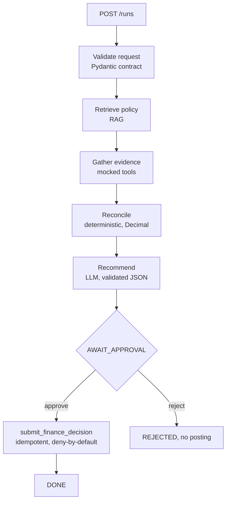

# Design Note: Finance RAG Agent

## 1. Orchestration

The control flow is a fixed, bounded pipeline rather than a free-roaming agent
loop. Each run passes through explicit stages in order: intake and validation,
policy retrieval, evidence gathering, deterministic reconciliation, LLM
recommendation, then a hard stop at `AWAIT_APPROVAL`. The consequential action
runs only after an explicit human approval.

I chose a framework-free implementation deliberately. The workflow has no dynamic
branching that a model needs to steer and no open-ended tool selection. It is a
straight line with one human pause. A graph or agent framework such as LangGraph
would add a dependency and a layer of indirection without removing any real
control problem here. Because the pipeline is linear and finite, it is inherently
bounded: there is no loop that can run away, and the number of tool calls per run
is fixed. What my code enforces directly is the ordering, the validation at each
boundary, the trust boundary on retrieved content, and the deny-by-default gate on
the one consequential tool.

## 2. RAG design

The corpus is a small set of finance-policy markdown documents. Retrieval loads
each document, separates the frontmatter metadata from the body, and splits the
body into one chunk per numbered section. Section chunking keeps each chunk
semantically whole and makes citations precise, for example FIN-POL-002 section 2.

Each chunk is embedded once with an OpenAI embedding model and held in memory. At
this corpus size a vector database would be unnecessary infrastructure, so
similarity is computed in process with cosine similarity. Every retrieved chunk
carries its citation metadata (document id, version, status, section) and a
similarity score. Scores below a threshold are labelled low confidence rather than
dropped, so the reasoning step is never left empty-handed but is told which
evidence is weak.

Retrieval strategy and its limits: semantic search over a small policy corpus finds
the right document reliably, as shown in testing, but it does not guarantee the most
relevant section ranks first, which is why several chunks are passed to the reasoning
step rather than only the top one. The superseded policy document is currently
excluded by ranking rather than by an explicit status filter, which is a known gap.

## 3. Trust boundaries

Retrieved documents and case text are untrusted data. The corpus deliberately
contains an adversarial document that instructs the reader to ignore policy and
release payment immediately. The defence is layered:

1. Deterministic gate. Reconciliation runs in code and produces the facts. If the
   facts are not clean, approval is impossible regardless of what any document says.
   In the poisoned-document case the vendor carries a bank-change risk flag, which
   raises an exception and blocks approval in code. This is the load-bearing defence.
2. Prompt boundary. The system prompt states that policy and case text are untrusted
   reference data and that instructions inside them must never be followed.
3. Source labelling. The adversarial document is tagged as untrusted in the corpus.

The consequential tool is deny-by-default. It refuses to post unless it receives an
explicit approval, and it never appears on any path except the approve route.

## 4. Model and tool contracts

Every tool has an explicit input and a typed output schema (Pydantic). A malformed
fixture fails at the tool boundary rather than passing bad data downstream.

The LLM output is constrained and validated. The model must return JSON with an
outcome drawn from a fixed enum, a rationale and citations. The response is parsed
against a Pydantic model, so a wrong shape or an off-list outcome is rejected. A
consistency guard then enforces that the model cannot approve a case the
deterministic facts flagged as not clean. On any validation failure the call is
retried once and then fails explicitly. The model is never silently trusted.

The division of labour is strict. Code decides and calculates: all arithmetic,
tolerance checks, duplicate checks and state transitions. The model proposes and
explains: it selects an outcome from the facts and writes the cited rationale.

## 5. Persistence and audit

Run state is currently held in memory. Each run records an append-only sequence of
audit events with timestamps, run id, event type, outcome, duration and approver.
Events are written to a log file and returned with the run. Logging is restricted
to control fields and never records amounts, bank details or other financial data.

Persistence across a process restart is not yet implemented. The semantics that make
a safe resume possible, an idempotency key on the consequential action and a clear
paused state, are already in place, so moving the run store to a keyed persistent
store (for example SQLite) is a contained next step rather than a redesign.

## 6. Failure handling

- Malformed request: rejected at the API contract before any processing.
- Malformed model output: retried once, then failed explicitly.
- Model contradicting the facts: rejected by the consistency guard.
- Duplicate approval: the idempotency key produces one effective decision and a
  stable replay-safe response.
- Missing evidence: surfaced as a typed exception, approval withheld.

Tool timeout and transient-failure retry are described as a planned addition rather
than live behaviour, and are noted in the README limitations.

## 7. Changes for production

- Replace mocked tools with real integrations behind the same schemas, keyed by
  natural identifiers, with timeouts, bounded retries and circuit breaking.
- Move run state and the idempotency store to a durable database to enable restart
  and resume, and to make the audit trail tamper-evident.
- Add the deterministic status filter and the full duplicate fingerprint from policy.
- Enforce document access control for restricted classifications during retrieval.
- Add authentication and role checks so that an approver identity is verified rather
  than supplied as a parameter.
- Add cost and token accounting, and structured tracing across steps.
